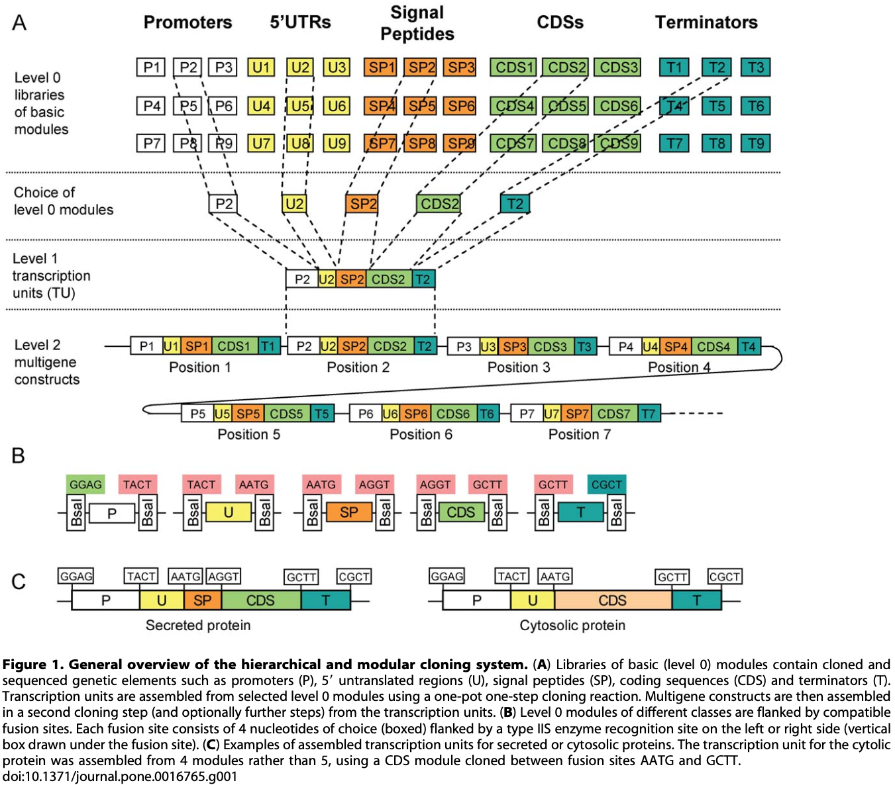
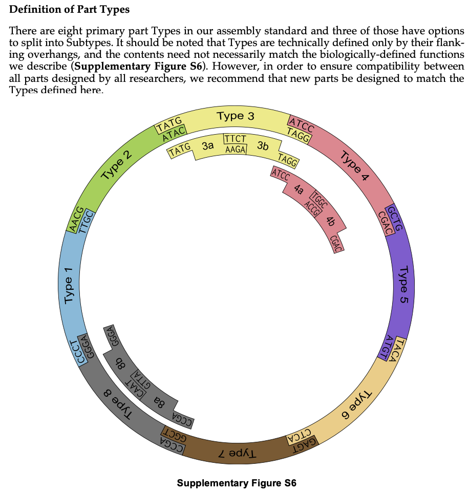
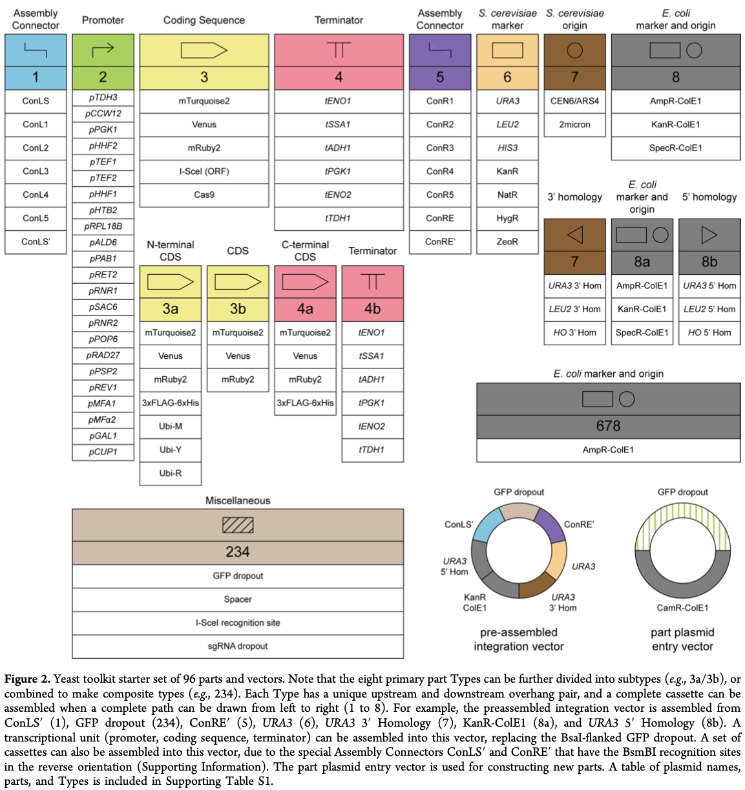

## Strains

### _E. coli_

- [NEB 5-alpha](https://www.neb.com/products/c2987-neb-5-alpha-competent-e-coli-high-efficiency)
  - genotype: `fhuA2 Δ(argF-lacZ)U169 phoA glnV44 Φ80 Δ(lacZ)M15 gyrA96 recA1 relA1 endA1 thi-1 hsdR17`
- [NEB 10-beta](https://www.neb.com/products/c3019-neb-10-beta-competent-e-coli-high-efficiency)
  - genotype: `Δ(ara-leu) 7697 araD139  fhuA ΔlacX74 galK16 galE15 e14-  ϕ80dlacZΔM15 recA1 relA1 endA1 nupG  rpsL (StrR) rph spoT1 Δ(mrr-hsdRMS-mcrBC)`
- [NEB Stable](https://www.neb.com/products/c3040-neb-stable-competent-e-coli-high-efficiency)
  - genotype: `F' proA+B+ lacIq ∆(lacZ)M15 zzf::Tn10 (TetR)/ ∆(ara-leu) 7697 araD139 fhuA ∆lacX74 galK16 galE15 e14- Φ80dlacZ∆M15 recA1 relA1 endA1 nupG rpsL (StrR) rph spoT1 ∆(mrr-hsdRMS-mcrBC)`

## MoClo

### [Sylvestre Marillonnet E. coli MoClo](https://www.addgene.org/kits/marillonnet-moclo/)

#### Enzymes
- Source DNA &rarr; pL0: `BbsI (BpiI)`
- pL0 &rarr; pL1: `BsaI`
- pL1 &rarr; pL2: `BbsI (BpiI)`

#### Overhangs

### [John Dueber MoClo Yeast Toolkit](https://www.addgene.org/kits/moclo-ytk/)

#### Enzymes
- Source DNA &rarr; pL0: `BsmBI`
- pL0 &rarr; pL1: `BsaI`
- pL1 &rarr; pL2: `BsmBI`

#### Overhangs

#### Parts

